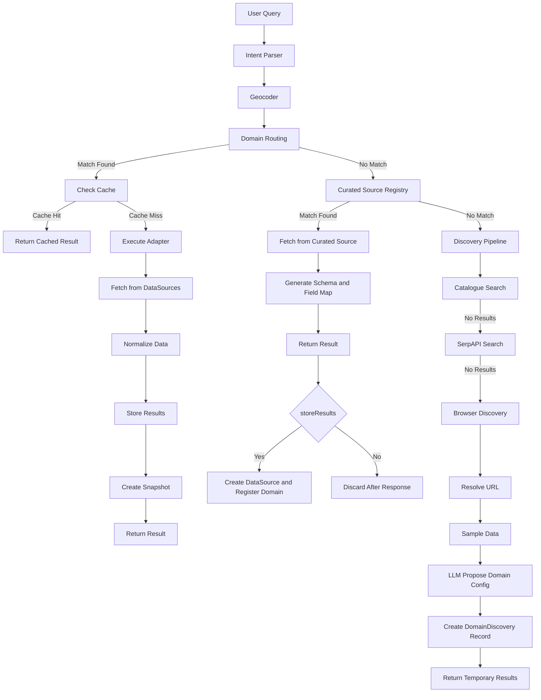
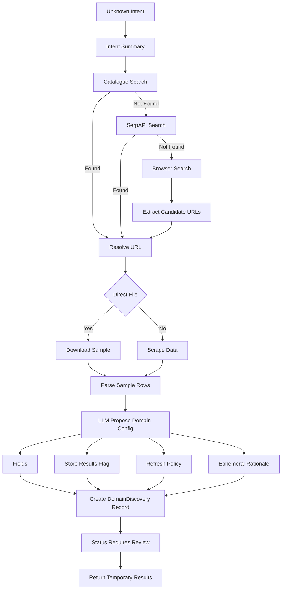
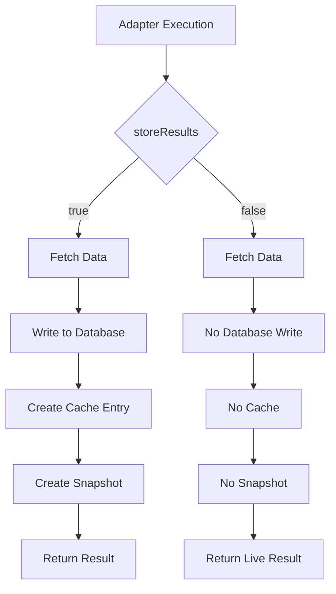
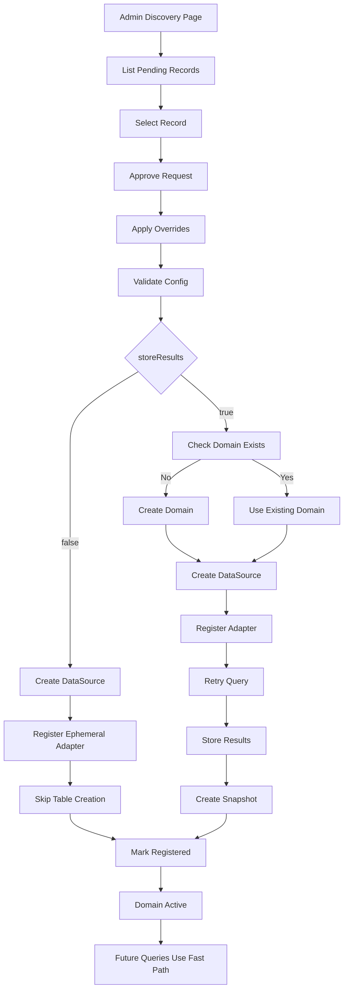

1️⃣ Main Query + Discovery Flow

```mermaid
flowchart TD

A[User Query] --> B[Intent Parser]
B --> C[Geocoder]
C --> D[Domain Routing]

D -->|Match Found| E[Check Cache]
E -->|Cache Hit| F[Return Cached Result]
E -->|Cache Miss| G[Execute Adapter]

G --> H[Fetch from DataSources]
H --> I[Normalize Data]
I --> J[Store Results]
J --> K[Create Snapshot]
K --> L[Return Result]

D -->|No Match| M[Curated Source Registry]

M -->|Match Found| N[Fetch from Curated Source]
N --> O[Generate Schema and Field Map]
O --> P[Return Result]

P --> Q{storeResults}
Q -->|Yes| R[Create DataSource and Register Domain]
Q -->|No| S[Discard After Response]

M -->|No Match| T[Discovery Pipeline]

T --> U[Catalogue Search]
U -->|No Results| V[SerpAPI Search]
V -->|No Results| W[Browser Discovery]

W --> X[Resolve URL]
X --> Y[Sample Data]
Y --> Z[LLM Propose Domain Config]

Z --> AA[Create DomainDiscovery Record]
AA --> AB[Return Temporary Results]
```

2️⃣ Discovery Pipeline

```mermaid
flowchart TD

A[Unknown Intent] --> B[Intent Summary]

B --> C[Catalogue Search]
C -->|Found| H[Resolve URL]

C -->|Not Found| D[SerpAPI Search]
D -->|Found| H

D -->|Not Found| E[Browser Search]
E --> F[Extract Candidate URLs]
F --> H

H --> I{Direct File}

I -->|Yes| J[Download Sample]
I -->|No| K[Scrape Data]

J --> L[Parse Sample Rows]
K --> L

L --> M[LLM Propose Domain Config]

M --> N[Fields]
M --> O[Store Results Flag]
M --> P[Refresh Policy]
M --> Q[Ephemeral Rationale]

N --> R[Create DomainDiscovery Record]
O --> R
P --> R
Q --> R

R --> S[Status Requires Review]
S --> T[Return Temporary Results]
```

3️⃣ Execution Model

```mermaid
flowchart TD

A[Adapter Execution] --> B{storeResults}

B -->|true| C[Fetch Data]
C --> D[Write to Database]
D --> E[Create Cache Entry]
E --> F[Create Snapshot]
F --> G[Return Result]

B -->|false| H[Fetch Data]
H --> I[No Database Write]
I --> J[No Cache]
J --> K[No Snapshot]
K --> L[Return Live Result]
```

4️⃣ Domain Approval + Registration

```mermaid
flowchart TD

A[Admin Discovery Page] --> B[List Pending Records]
B --> C[Select Record]
C --> D[Approve Request]

D --> E[Apply Overrides]
E --> F[Validate Config]

F --> G{storeResults}

G -->|false| H[Create DataSource]
H --> I[Register Ephemeral Adapter]
I --> J[Skip Table Creation]
J --> K[Mark Registered]

G -->|true| L[Check Domain Exists]

L -->|No| M[Create Domain]
L -->|Yes| N[Use Existing Domain]

M --> O[Create DataSource]
N --> O

O --> P[Register Adapter]
P --> Q[Retry Query]

Q --> R[Store Results]
R --> S[Create Snapshot]

S --> K

K --> T[Domain Active]
T --> U[Future Queries Use Fast Path]
```
